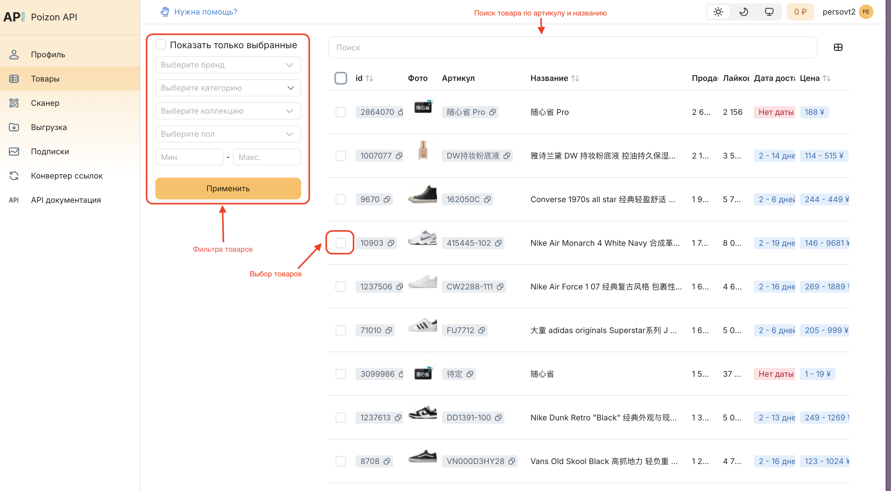
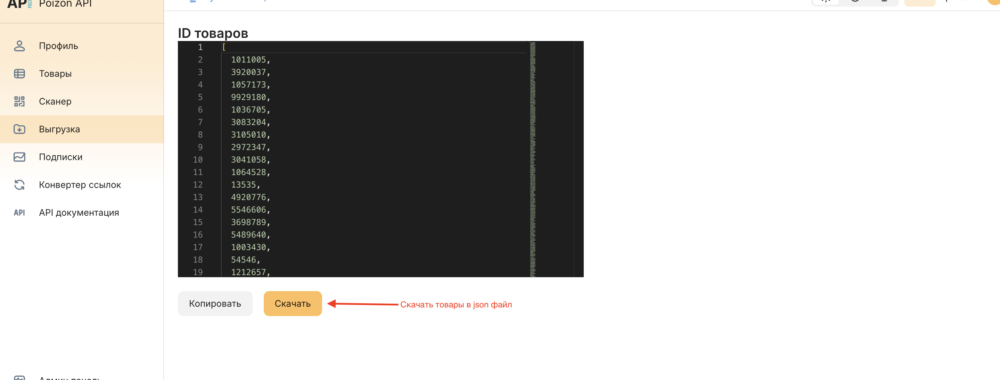

1. Заходим на страницу товаров:

   

2. Выбираем нужные фильтра для товара

3. Выбираем все товары. Нажимаем чек-боксы в колонке. Также можно выбрать товары, нажав на чек-бокс слева-сверху таблицы

4. Скачиваем выбранные товары на вкладке “Выгрузка“

   

5. Отправляем скаченный файл менеджеру

6. Выбираем нужные трансформации и формат для файла

   1. Трансформации: перевод названия, генерация ya gpt описания, перевод параметров, откидываем китайские символы (уточнять у менеджера)

   2. Формат файла: csv, json, excel, insales, woocomerce (уточнять у менеджера)

7. Оплачиваем выгрузку и ждем готового файла

8. В течении 1 дня проверяем, что все хорошо, если что вносим правки в выгрузку

   

   

   
